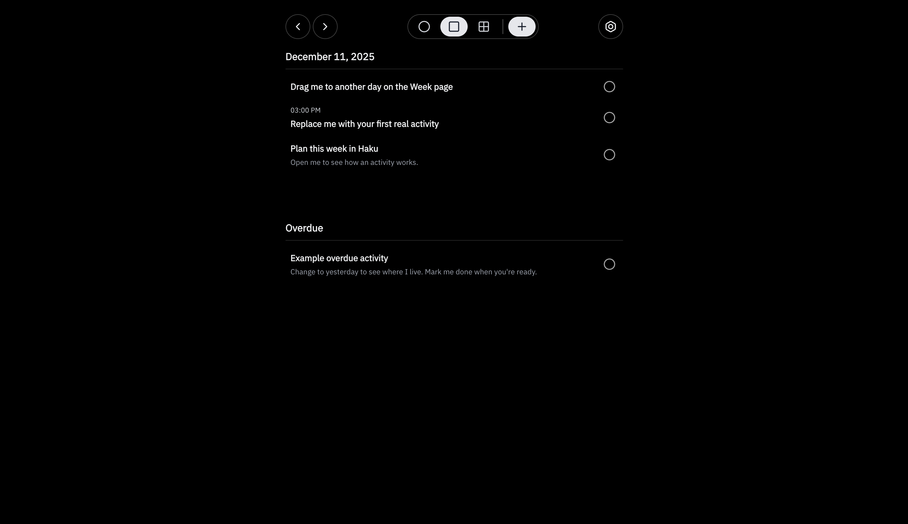
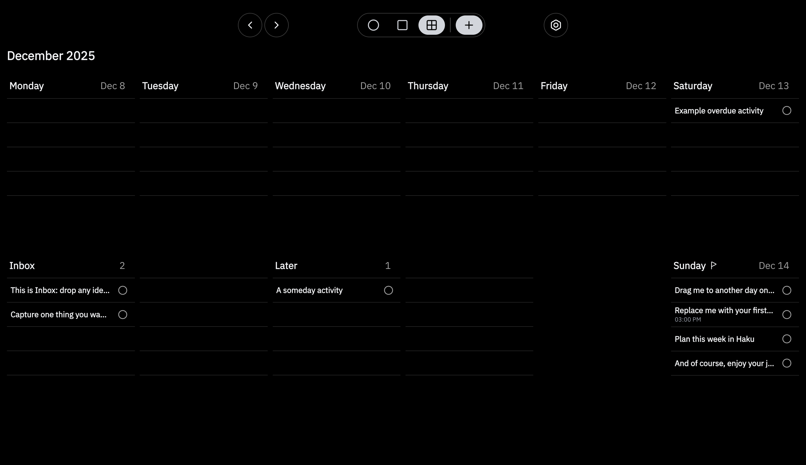
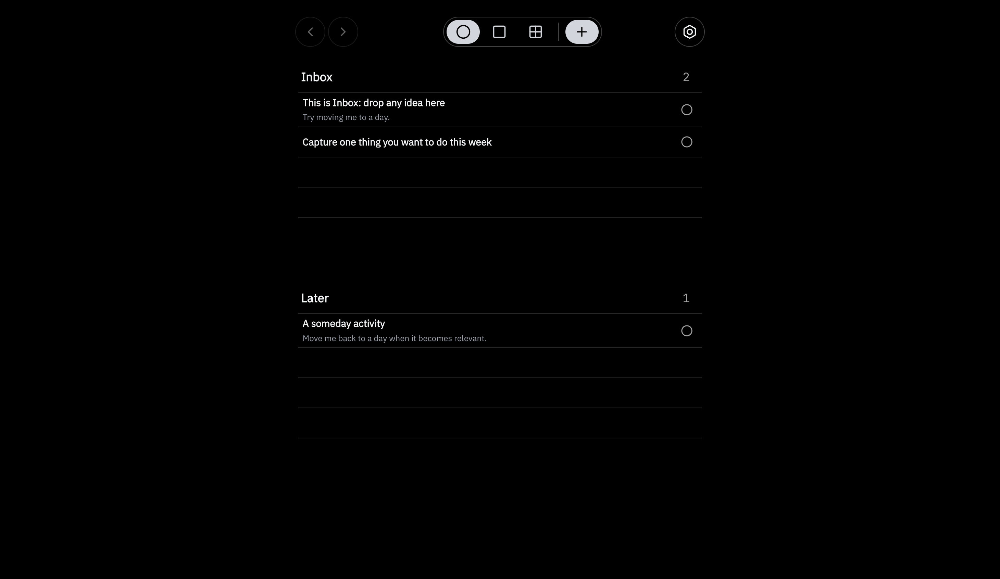
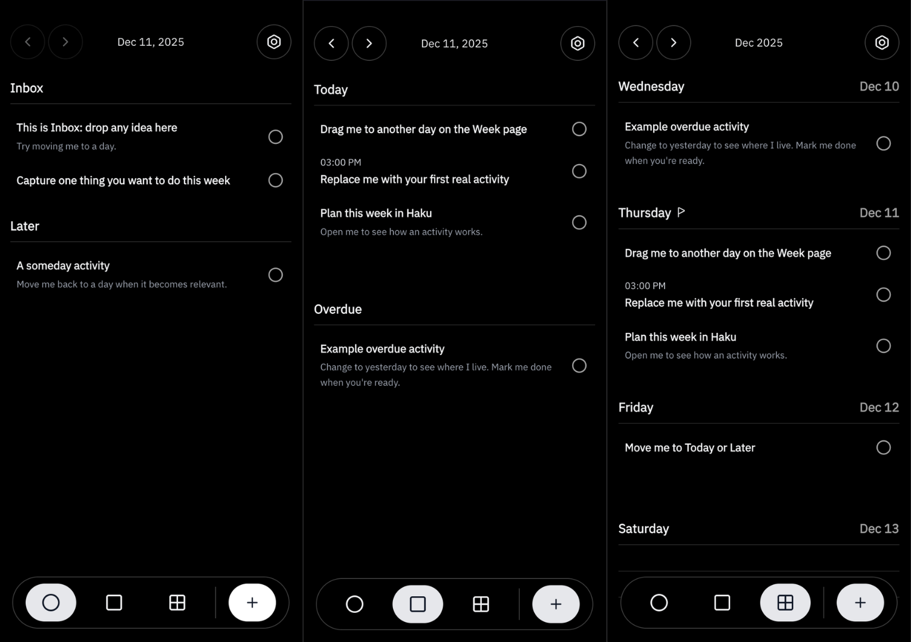

# Haku — Calm, Local-First Weekly Planner

A quiet planner that unifies calendar and todos into one simple system: activities. Plan Today and shape the week with Day/Week/Board views, Inbox and Later, drag-and-drop, and keyboard shortcuts — stored locally in your browser and installable as a PWA.

> One object (**activity**). No projects, tags, priorities, or busy dashboards.

## Screenshots

<details>
  <summary><strong>Desktop</strong> (Day • Week • Board)</summary>

  <br />

  

  <br /><br />

  

  <br /><br />

  
</details>

<details>
  <summary><strong>Mobile</strong> (Board • Day • Week)</summary>

  <br />

  
</details>

## Overview

Haku is built around one type of object: an **activity**.

There’s no split between “task” and “event.” An activity can be:

- **Timed** (e.g., `6:30 PM • 90 min • Aikido training`)
- **Untimed but dated** (e.g., `Sometime Friday — clean kitchen`)
- **Unscheduled** in **Inbox** (capture) or **Later** (not now)

The app is designed for people who want a calm surface for **Today** and **This Week**, without maintaining a system.

## What Haku does

### Three views

- **Day** — your primary view: Today, plus a nearby **Overdue** section.
- **Week** — a wide-angle view to shape the week and rebalance across days.
- **Board** — capture-only mode: **Inbox** and **Later** as simple lists.

### One model

An activity is intentionally boring:

- `title`
- optional `note`
- optional `date`
- optional `time` + `duration`
- `list`: `"inbox" | "day" | "later"`
- `completed`: `boolean`

Rich meaning lives in your head; Haku stores only the handle.

## Features

- **One object: activities** — no duplicate “task vs event” models.
- **Drag & drop planning** — move activities between days and sections.
- **Light “repeat” via duplication** — copy timed activities forward across days/weeks (no recurrence engine).
- **Local-first & offline** — stored in your browser via `localStorage`.
- **Installable PWA** — manifest + service worker (offline support + install flow on supported browsers).
- **Keyboard-friendly (desktop)** — quick creation/navigation shortcuts.
- **Minimal motion** — subtle transitions that support orientation, not distraction.

## Data & privacy

- **Storage:** `localStorage` (key: `haku:v1:state`)
- **Offline by default:** no server, no accounts.
- **Backups:** Import/export is provided to move data between devices.

If I ever add sync, it will be clearly documented and **opt-in**.

> **Note on storage:** Haku persists data in your browser via localStorage. It’s private (stays on your device) but not encrypted. Use **Export** to keep backups.

## Getting started

### Requirements

- Node.js (LTS or newer)
- pnpm

### Install & run

```bash
pnpm install
pnpm run dev
```

### Build & preview

```bash
pnpm run build
pnpm run preview
```

## Scripts

- `pnpm run dev` — start dev server
- `pnpm run build` — production build
- `pnpm run preview` — preview built app

## Repository structure

High-level entry points:

- `src/main.tsx` — app entry
- `src/app/App.tsx` — composition + routing
- `src/app/shell/*` — layout primitives (desktop/mobile headers + mobile tab bar)

Feature areas:

- `src/features/day` — Day view
- `src/features/week` — Week view + column distribution logic
- `src/features/board` — Board view (Inbox/Later)
- `src/features/settings` — Settings + install instructions

Core domain + shared code:

- `src/shared/types/activity.ts` — activity schema
- `src/shared/state/*` — store, persistence, import/export
- `src/shared/ui/*` — cards/rows, modals, date/time pickers, drag overlay, animations
- `src/shared/hooks/*` — media queries, PWA install flow, touch drag helpers

Static assets:

- `public/icons/site.webmanifest` + `public/icons/*` — PWA manifest/icons
- `public/fonts/*` — custom fonts
- `public/images/*` — README screenshots

## Keyboard shortcuts (desktop)

- **New activity:** `Cmd/Ctrl + K`
- **Close dialogs:** `Esc`
- **Confirm:** `Enter`

## Contributing

If you want to poke around:

- Keep changes **small and focused**.
- Prefer **clarity** over clever abstractions.
- Test on **mobile + desktop** (touch + mouse).

## License

Original work by Kyle Brooks. See `LICENSE` and `NOTICE`.